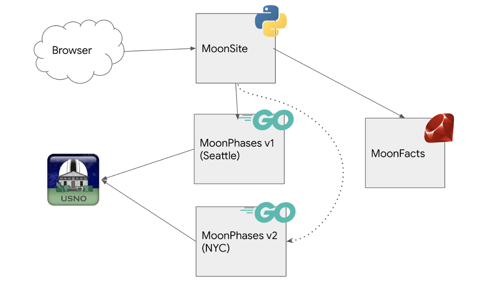

MoonInfo is a microservices application. It consists of:

1. **[MoonSite](https://github.com/m-okeefe/moonsite)** - a frontend Python Flask app that shows Moon phase information for a given U.S. city, and a random fun fact about the Moon.
2. **[MoonPhases](https://github.com/m-okeefe/moonphases)** - a Golang gRPC server (preview). Exposes a single endpoint to get moon phase info. MoonPhases calls the U.S. Naval Observatory API, and is configured at startup to fetch this information for one U.S. city. 
3. **[MoonFacts](https://github.com/m-okeefe/moonfacts)**-  a Ruby HTTP server (preview). Holds a static list of Moon fun facts, from a local text file. Exposes a single endpoint, which returns one of these Moon facts at random. 

